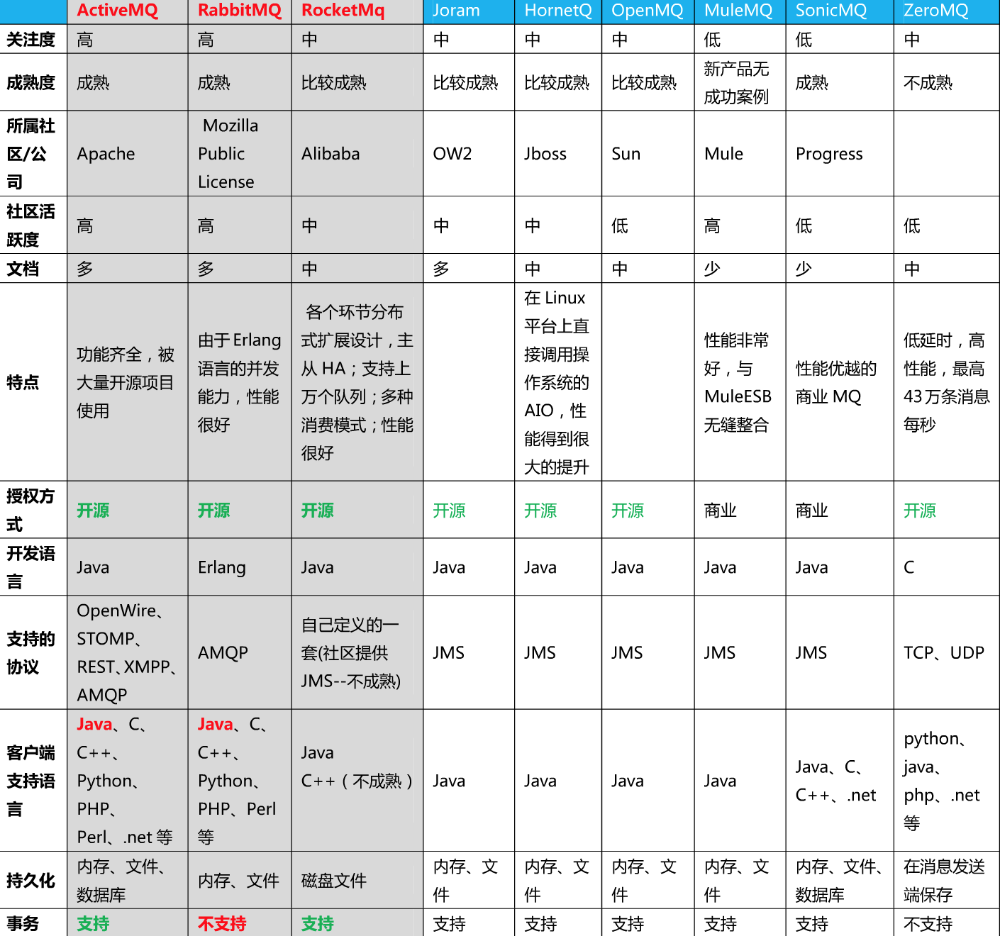
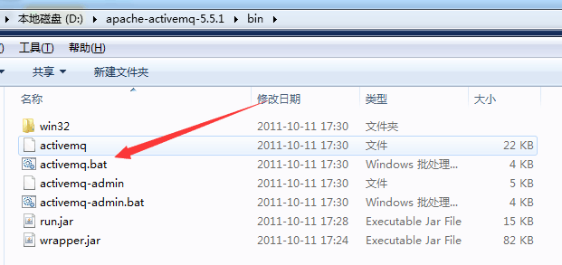
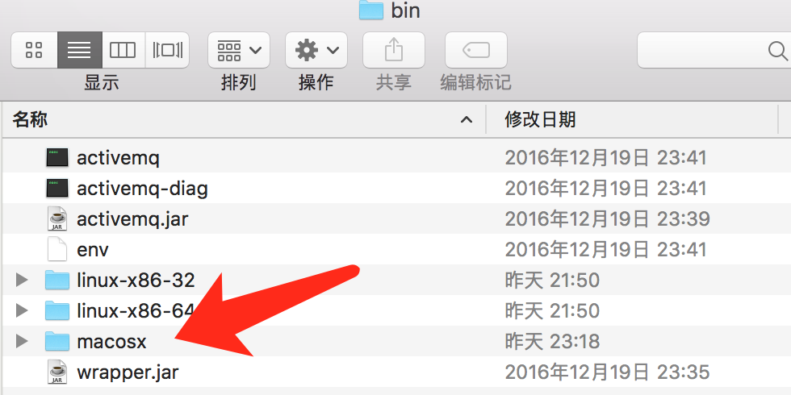
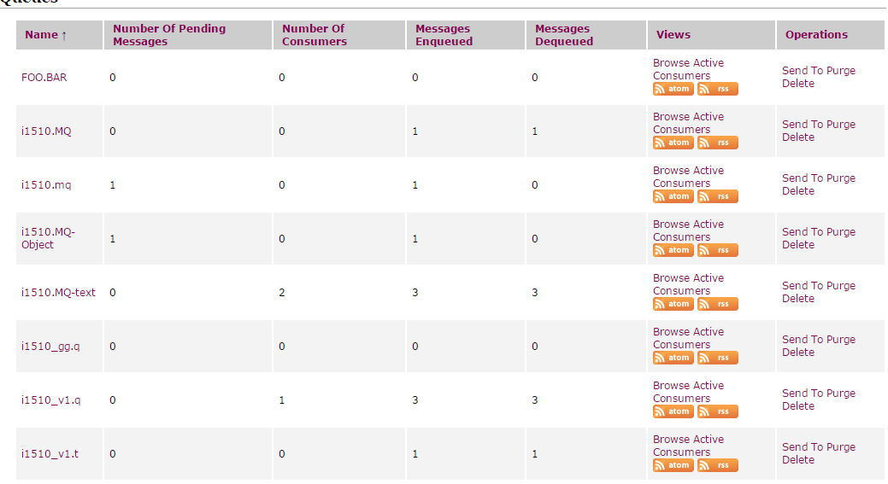
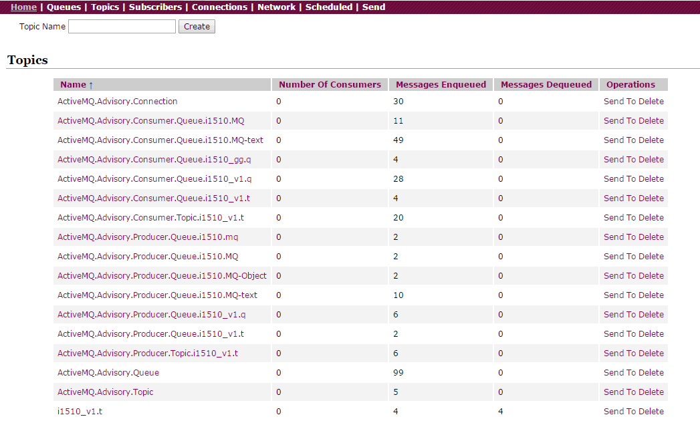

学习笔记-ActiveMQ
============================

By [rambo](http://hengxindongli.cn)

## 一、简介
消息传递框架很多，要解释很麻烦，直接来张图对比下


## 二、部署
- 我想说绿色版免安装
- 地址：http://activemq.apache.org/activemq-5143-release.html
- 下载后解压（PS：一定要解压到中文目录下，不然你就明白有多坑了）
- 进入解压目录：windows系统下找到bin目录下的activemq.bat（也可以选择32位）

- macOS系统下启动终端，cd进入 解压后的目录 bin->macosx，执行./activemq start

- macOS系统下关闭服务命令：./activemq stop
- 启动后在浏览地址：http://127.0.0.1:8161/admin/queues.jsp 端口固定，账号密码默认都为admin
## 三、与spring3.x结合
- 注意xml抬头的xmlns 还有版本号，这是坑最多的地方

```xml
<?xml version="1.0" encoding="UTF-8"?>
<beans xmlns="http://www.springframework.org/schema/beans"
	xmlns:xsi="http://www.w3.org/2001/XMLSchema-instance" xmlns:context="http://www.springframework.org/schema/context"
	xmlns:jpa="http://www.springframework.org/schema/data/jpa" xmlns:tx="http://www.springframework.org/schema/tx"
	xmlns:p="http://www.springframework.org/schema/p" xmlns:util="http://www.springframework.org/schema/util"
	xmlns:amq="http://activemq.apache.org/schema/core" xmlns:jms="http://www.springframework.org/schema/jms"
	xmlns:cache="http://www.springframework.org/schema/cache"
	default-autowire="byName" xmlns:aop="http://www.springframework.org/schema/aop"
	xsi:schemaLocation="http://www.springframework.org/schema/aop http://www.springframework.org/schema/aop/spring-aop-3.1.xsd
	http://www.springframework.org/schema/beans http://www.springframework.org/schema/beans/spring-beans-3.1.xsd
	http://www.springframework.org/schema/data/jpa http://www.springframework.org/schema/data/jpa/spring-jpa-1.2.xsd 
	http://www.springframework.org/schema/tx http://www.springframework.org/schema/tx/spring-tx-3.1.xsd
	http://www.springframework.org/schema/context http://www.springframework.org/schema/context/spring-context-3.1.xsd
	http://www.springframework.org/schema/util http://www.springframework.org/schema/util/spring-util-3.1.xsd
	http://www.springframework.org/schema/cache http://www.springframework.org/schema/cache/spring-cache-3.1.xsd
        http://www.springframework.org/schema/jms
        http://www.springframework.org/schema/jms/spring-jms-3.1.xsd
        http://activemq.apache.org/schema/core
        http://activemq.apache.org/schema/core/activemq-core-5.12.1.xsd">


	<!-- 定义资源配置文件 统一在common中加载
	<context:property-placeholder
		location="classpath:/config/activeMQ/application*.properties" />-->


	<!-- ******activeMQ 工厂链接****** -->
	<amq:connectionFactory id="amqConnectionFactory"
		brokerURL="${mq.brokerURL}" userName="${mq.userName}" password="${mq.password}" />
	
	<!-- ******activeMQ Start****** -->
	<!-- 配置JMS连接工厂 -->
	<bean id="connectionFactory"
		class="org.springframework.jms.connection.CachingConnectionFactory">
		<constructor-arg ref="amqConnectionFactory" />
		<property name="sessionCacheSize" value="100" />
	</bean>
	
	<!-- 配置文本消息队列 Start-->
	<!-- 定义消息队列默认 -->
	<bean id="textQueueDestination" class="org.apache.activemq.command.ActiveMQQueue">
		<!-- 设置消息队列的名字 -->
		<constructor-arg index="0" value="i1510.MQ-text"/>
	</bean>

	<!-- 配置JMS模板（Queue），Spring提供的JMS工具类，它发送、接收消息。 -->
	<bean id="jmsTextTemplate" class="org.springframework.jms.core.JmsTemplate">
		<property name="connectionFactory" ref="connectionFactory" />
		<property name="defaultDestination" ref="textQueueDestination" />
		<property name="receiveTimeout" value="10000" />
		<!-- true是topic，false是queue，默认是false，此处显示写出false -->
		<property name="pubSubDomain" value="false" />
		<!--<property name="concurrentConsumers" value="2-4"/> 启动2-4个Listener实例来消费消息 2-4表示最小并发数是2，最大并发数为4-->
	</bean>


	<!-- 配置消息队列监听者（Queue） -->
	<bean id="textQueueMessageListener" class="org.i1510.activeMq.listener.TextQueueMessageListener" />

	<!-- 显示注入消息监听容器（Queue），配置连接工厂，监听的目标是demoQueueDestination，监听器是上面定义的监听器 -->
	<bean id="textQueueListenerContainer"
		class="org.springframework.jms.listener.DefaultMessageListenerContainer">
		<property name="connectionFactory" ref="connectionFactory" />
		<property name="destination" ref="textQueueDestination" />
		<property name="messageListener" ref="textQueueMessageListener" />
	</bean>
	<!-- 配置文本消息队列 End-->
	
	<!-- 配置topic订阅发布 Start-->
	<!-- 定义发布 -->
	<bean id="topicPublishDestination" class="org.apache.activemq.command.ActiveMQTopic">
		<constructor-arg index="0" value="${mq.topic.publish}"/>
	</bean>
	<!-- 定义订阅 -->
	<bean id="topicSubscribeDestination" class="org.apache.activemq.command.ActiveMQTopic">
		<constructor-arg index="0" value="${mq.topic.subscribe}"/>
	</bean>

	<!-- 配置JMS模板（Queue），Spring提供的JMS工具类，它发送、接收消息。 -->
	<bean id="jmsTopicTemplate" class="org.springframework.jms.core.JmsTemplate">
		<property name="connectionFactory" ref="connectionFactory" />
		<property name="defaultDestination" ref="topicPublishDestination" />
		<property name="receiveTimeout" value="10000" />
		<!-- true是topic，false是queue，默认是false，此处显示写出false -->
		<property name="pubSubDomain" value="true" />
		<!--<property name="concurrentConsumers" value="2-4"/> 启动2-4个Listener实例来消费消息 2-4表示最小并发数是2，最大并发数为4-->
	</bean>


	<!-- 配置消息队列监听者（Queue） -->
	<bean id="topicMessageListener" class="org.i1510.activeMq.listener.ObjectTopicMessageListener" />

	<!-- 显示注入消息监听容器（Queue），配置连接工厂，监听的目标是demoQueueDestination，监听器是上面定义的监听器 -->
	<bean id="topicListenerContainer"
		class="org.springframework.jms.listener.DefaultMessageListenerContainer">
		<property name="connectionFactory" ref="connectionFactory" />
		<property name="destination" ref="topicSubscribeDestination" />
		<property name="messageListener" ref="topicMessageListener" />
	</bean>
	<!-- 配置topic订阅发布 End-->
	
	<!-- 配置对象消息队列 Start-->
	<!-- 定义消息队列发出 -->
	<bean id="objectQueueSendDestination" class="org.apache.activemq.command.ActiveMQQueue">
		<!-- 设置消息队列的名字 -->
		<constructor-arg index="0" value="${mq.queue.send}"/>
	</bean>
	<!-- 定义消息队列接收 -->
	<bean id="objectQueueReceiveDestination" class="org.apache.activemq.command.ActiveMQQueue">
		<!-- 设置消息队列的名字 -->
		<constructor-arg index="0" value="${mq.queue.recevie}"/>
	</bean>

	<!-- 配置JMS模板（Queue），Spring提供的JMS工具类，它发送、接收消息。 -->
	<bean id="jmsObjectTemplate" class="org.springframework.jms.core.JmsTemplate">
		<property name="connectionFactory" ref="connectionFactory" />
		<property name="defaultDestination" ref="objectQueueSendDestination" />
		<property name="receiveTimeout" value="10000" />
		<!-- true是topic，false是queue，默认是false，此处显示写出false -->
		<property name="pubSubDomain" value="false" />
	</bean>


	<!-- 配置消息队列监听者（Queue） -->
	<bean id="objectQueueMessageListener" class="org.i1510.activeMq.listener.ObjectQueueMessageListener" />

	<!-- 显示注入消息监听容器（Queue），配置连接工厂，监听的目标是demoQueueDestination，监听器是上面定义的监听器 -->
	<bean id="objectQueueListenerContainer"
		class="org.springframework.jms.listener.DefaultMessageListenerContainer">
		<property name="connectionFactory" ref="connectionFactory" />
		<property name="destination" ref="objectQueueReceiveDestination" />
		<property name="messageListener" ref="objectQueueMessageListener" />
	</bean>
	<!-- 配置对象消息队列 End-->
	<!-- ******activeMQ End****** -->
</beans>
```
- 资源文件

```
#以下为设置
#发送队列的名 一般是当前系统的名
mq.queue.send=i1510_v1.q
#接收队列的名 一般应是对方系统的名
mq.queue.recevie=i1510_v1.q
#发送订阅的名
mq.topic.publish=i1510_v1.t
#接收订阅的名
mq.topic.subscribe=i1510_v1.t
#mq服务器
mq.brokerURL=tcp://172.18.127.141:61616
mq.userName=admin
mq.password=admin

```
- 相关jar包：注意maven下不要重复你用会有大坑。

```xml
<!-- spring -->
    <dependency>
      <groupId>org.springframework</groupId>
      <artifactId>spring-core</artifactId>
      <version>${springframework}</version>
    </dependency>
    <dependency>
      <groupId>org.springframework</groupId>
      <artifactId>spring-context</artifactId>
      <version>${springframework}</version>
    </dependency>
    <dependency>
      <groupId>org.springframework</groupId>
      <artifactId>spring-tx</artifactId>
      <version>${springframework}</version>
    </dependency>
    <dependency>
      <groupId>org.springframework</groupId>
      <artifactId>spring-webmvc</artifactId>
      <version>${springframework}</version>
    </dependency>
    <dependency>
      <groupId>org.springframework</groupId>
      <artifactId>spring-jms</artifactId>
      <version>${springframework}</version>
    </dependency>
    <!-- xbean 如<amq:connectionFactory /> -->
    <dependency>
      <groupId>org.apache.xbean</groupId>
      <artifactId>xbean-spring</artifactId>
      <version>3.16</version>
    </dependency>

    <!-- activemq -->
    <dependency>
      <groupId>org.apache.activemq</groupId>
      <artifactId>activemq-core</artifactId>
      <version>5.7.0</version>
    </dependency>
    <dependency>
      <groupId>org.apache.activemq</groupId>
      <artifactId>activemq-pool</artifactId>
      <version>5.12.1</version>
    </dependency>
```

- 关键的来了
- 以下代码可直接拷贝都经过验证
- 队列消息-queue：生产者

```java
package org.i1510.activeMq.service;

import javax.jms.Destination;
import javax.jms.JMSException;
import javax.jms.Message;
import javax.jms.Session;

import org.i1510.activeMq.bean.Mq;
import org.springframework.beans.factory.annotation.Autowired;
import org.springframework.jms.core.JmsTemplate;
import org.springframework.jms.core.MessageCreator;
import org.springframework.stereotype.Service;

/**
 * 生产者
 */
@Service("iProducerObjectService")
public class IProducerObjectService {

	@Autowired
	private JmsTemplate jmsObjectTemplate;

	/**
	*@Author Rambo
	*@Desc：发送到指定的队列名
	*@param destination
	*@param mq TODO
	*@Version  IProducerObjectService.java,v 1.1 2017年2月22日 上午10:52:09 
	*/
	public void sendMessage(String destination, final Mq mq) {
		System.out.println(Thread.currentThread().getName() + " 向队列"
				+ destination.toString() + "发送消息---------------------->" + mq.getObj());
		try {
			Destination dest = jmsObjectTemplate.getConnectionFactory().createConnection().createSession(false, Session.AUTO_ACKNOWLEDGE).createQueue(destination);
			jmsObjectTemplate.send(dest, new MessageCreator() {
				public Message createMessage(Session session) throws JMSException {
					return session.createObjectMessage(mq);
				}
			});
		} catch (JMSException e) {
			// TODO Auto-generated catch block
			e.printStackTrace();
		}
		
	}

	public void sendMessageMq(final Mq mq) {
		String destination = jmsObjectTemplate.getDefaultDestination()
				.toString();
		System.out.println(Thread.currentThread().getName() + " 向队列"
				+ destination + "发送消息---------------------->" + mq);
		jmsObjectTemplate.send(new MessageCreator() {
			public Message createMessage(Session session) throws JMSException {
				return session.createObjectMessage(mq);
			}
		});
	}
}


```


- 队列消息-queue：监听器（监听接收）

```java
package org.i1510.activeMq.listener;

import javax.jms.Message;
import javax.jms.MessageListener;

import org.apache.activemq.command.ActiveMQObjectMessage;
import org.i1510.activeMq.bean.Mq;

/**
 * @author rambo 监听activeMQ消息队列
 *
 */
public class ObjectQueueMessageListener implements MessageListener {
	public void onMessage(Message message) {
		if(message instanceof ActiveMQObjectMessage){
			
			ActiveMQObjectMessage mq = (ActiveMQObjectMessage) message;
			try {
				if(mq.getObject() instanceof Mq){
					Mq mmq = (Mq)(mq.getObject());
					System.out.println("ObjectQueueMessageListener监听到队列"+mq.getDestination().getQualifiedName()+"消息：\t"
							+ mmq.getObj());
				}else{
					System.out.println("ObjectQueueMessageListener监听到了消息：\t"
							+ mq.getClass());
				}
			} catch (Exception e) {
				e.printStackTrace();
			}
		}else{
			System.out.println("ObjectQueueMessageListener监听到了消息：\t"
					+ message.getClass());
		}

	}
}


```


- 队列消息-queue：消费者（主动接收）

```java
package org.i1510.activeMq.service;
import org.springframework.beans.factory.annotation.Autowired;
import org.springframework.jms.core.JmsTemplate;
import org.springframework.stereotype.Service;

import javax.annotation.Resource;
import javax.jms.Destination;
import javax.jms.JMSException;
import javax.jms.TextMessage;

/**
 * 消费者 已经改为监听自动获取
 */
@Service("iConsumerService")
public class IConsumerService {
	@Autowired
    private JmsTemplate jmsTextTemplate;

    public TextMessage receive(Destination destination){
        TextMessage textMessage = (TextMessage) jmsTextTemplate.receive(destination);
        try{
            System.out.println("从队列" + destination.toString() + "收到了消息：\t"
                    + textMessage.getText());
        } catch (JMSException e) {
            e.printStackTrace();
        }
        return textMessage;
    }
}


```


- 订阅发布消息-topic：发布

```java

package org.i1510.activeMq.service;

import javax.jms.JMSException;
import javax.jms.Message;
import javax.jms.Session;

import org.i1510.activeMq.bean.Mq;
import org.springframework.beans.factory.annotation.Autowired;
import org.springframework.jms.core.JmsTemplate;
import org.springframework.jms.core.MessageCreator;
import org.springframework.stereotype.Service;

/**
 * 发布
 */
@Service("iTopicSendService")
public class ITopicSendService {

	@Autowired
	private JmsTemplate jmsTopicTemplate;


	public void sendMessageMq(final Mq mq) {
		String destination = jmsTopicTemplate.getDefaultDestination()
				.toString();
		System.out.println(Thread.currentThread().getName() + " 向Topic"
				+ destination + "发送消息---------------------->" + mq);
		jmsTopicTemplate.send(new MessageCreator() {
			public Message createMessage(Session session) throws JMSException {
				return session.createObjectMessage(mq);
			}
		});
	}
}

```

- 订阅发布消息-topic：订阅（监听 就不在写主动获取了）

```java

package org.i1510.activeMq.listener;

import javax.jms.Message;
import javax.jms.MessageListener;

import org.apache.activemq.command.ActiveMQObjectMessage;
import org.i1510.activeMq.bean.Mq;

/**
 * @author rambo 监听activeMQ topic
 *
 */
public class ObjectTopicMessageListener implements MessageListener {
	public void onMessage(Message message) {
		if(message instanceof ActiveMQObjectMessage){
			
			ActiveMQObjectMessage mq = (ActiveMQObjectMessage) message;
			try {
				if(mq.getObject() instanceof Mq){
					Mq mmq = (Mq)(mq.getObject());
					System.out.println("ObjectQueueMessageListener监听到topic"+mq.getDestination().getQualifiedName()+"消息：\t"
							+ mmq.getObj());
				}else{
					System.out.println("ObjectQueueMessageListener监听到了消息：\t"
							+ mq.getClass());
				}
			} catch (Exception e) {
				e.printStackTrace();
			}
		}else{
			System.out.println("ObjectQueueMessageListener监听到了消息：\t"
					+ message.getClass());
		}

	}
}

```
## 四、最终效果
> 如果所示（好像是废话）
> 稍微解释下
> name是队列名称 队列名区分大小写
> Number Of Pending Messages  是队列中有多少个消息等待出队列
> Number Of Consumers  是队列中有多少个消费者
> Messages Enqueued  是队列共有多少个信息
> Messages Dequeued  是队列中已经出列多少个消息


## 五、联系
志同道合联系我，请注明：来自blog


---
