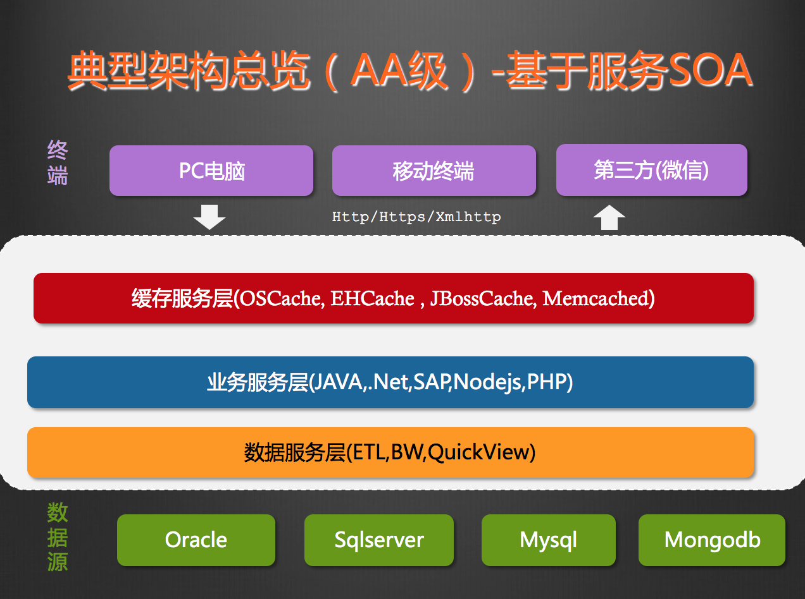

技术人生-寂寞咖啡因
============================

By [rambo](http://hengxindongli.cn)
## 一、简介
人有两条路要走， 一条是必须走的，一条是想走的，你必须把必须走的路走漂亮，才可以走想走的路。
> 年轻的时候，我们懒，我们三分钟热度。  
> 我们缺乏社会阅历，我们没车没房。  
> 这都很正常。  
> 但，  
> 最怕你碌碌无为，却安慰自己平凡可贵。

## 二、技术经验
- 前端：Dojo、AngularJs、ExtJs、Jquery、Bootstrap、EasyUI、Vuejs、ReactJs、Iconic、SeaJs
- 后端：Java（SpringMvc、SpringSecurity、Struts1.x、Struts2.x、Hibernate、Ibatis、MyBatis、JPA、Shiro）
- 脚本：PHP(ecshop、thinkPhp)、Python(pandas、tushare、sqlalchemy、crontab、SKlearn)
- 数据库：Redis、Mysql、Oracle、MsSql、MongoDb
- 操作系统：Windows、CentOS、Mac OS
- 分布式框架：Dubbox
- 消息框架：ActiveMQ、RocketMQ、redission-MQ
- 其他：Nginx、Git、Maven、Haproxy、Hadoop、Spark、ZooKeeper、ElasticSearch
- 正研究ing：scala
## 三、常见架构
- 基于SOA设计

## 四、目标

> 小而美的产品方能大道至简。  
I hear and I forget. I see and I remember. I do and I understand

- 业务模型化（业务抽象成模型）  
- 模型组件化（模型转化为可拆解的组件）  
- 组件服务化（组件以服务的思维为导向）  
- 服务可视化（准确定位，阐释所提供的服务）  

## 五、联系
志同道合联系我，请注明：来自blog

---
