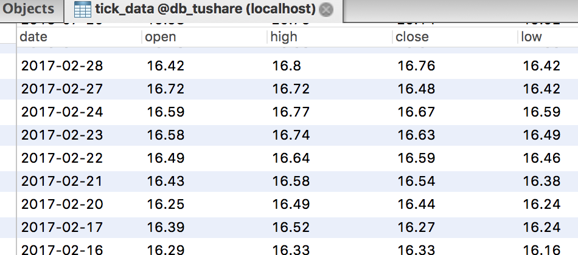

量化投资
============================

By [rambo](http://hengxindongli.cn)

## 一、简介
量化投资是指通过数量化方式及计算机程序化发出买卖指令，以获取稳定收益为目的的交易方式。

## 二、技术经验
- 工具：pycharm
- 语言：python3.6（不用2.x，因为3.x不兼容）
- 用到的模块：tushare、pandas、sqlalchemy、pymysql
- pycharm安装模块如下图


- 注意要先在终端执行 python3.6 -m pip install requests，pip必须要9.0版本以上，这是坑，一个很大的坑。
- 以下是获取指定的股票历史数据，话不多说，上代码

```python

#!/usr/bin/env
# coding:utf-8
import pymysql
import tushare as ts
import pandas as pd
from sqlalchemy import create_engine


print(ts.__version__)


df = ts.get_hist_data('601566') #一次性获取全部日k线数据
#print(df)

engine = create_engine('mysql+pymysql://root:@127.0.0.1/db_tushare?charset=utf8')
#存入数据库

#写入数据
pd.io.sql.to_sql(df, 'tick_data', engine, index=True, if_exists='append')
#读取数据
show = pd.io.sql.read_sql('select * from test;', con=engine)

print(show)


```

- 看看你的数据库吧，是不是有数据了？



## 主要使用资料地址

- tushare:http://tushare.org
- pandas:http://pandas.pydata.org/pandas-docs/version/0.16.2
- 多股票RSI算法示例：https://www.ricequant.com/api/python/chn#python-sample-strategy-multi-RSI