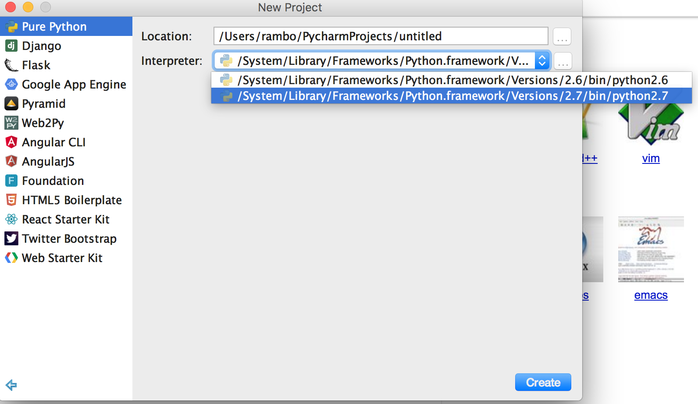
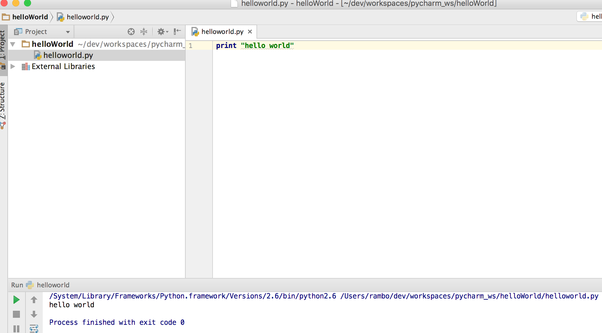
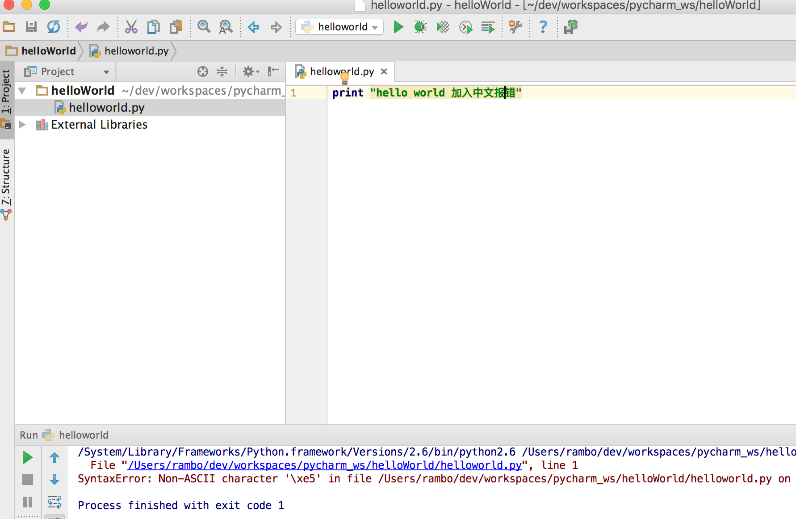
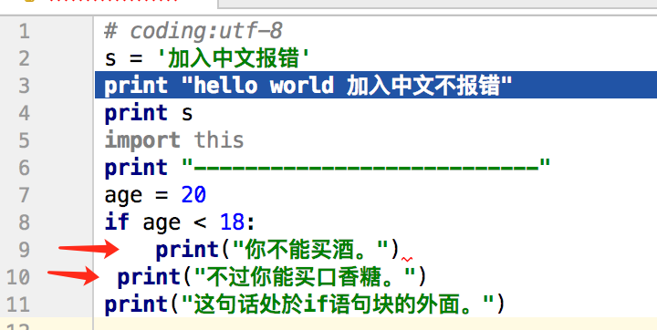

学习笔记-phthon
============================

By [rambo](http://hengxindongli.cn)
## 一、简介
好吧，普及下知识：
Python完全免费，众多开源的科学计算库都提供了Python的调用接口。是一种易学、更严谨的程序设计语言。它能让用户编写出更易读、易维护的代码。Python有着丰富的扩展库，可以轻易完成各种高级任务，开发者可以用Python实现完整应用程序所需的各种功能。
摘录一段来自python的名言
> Beautiful is better than ugly.  
> Explicit is better than implicit.  
> Simple is better than complex.  
> Complex is better than complicated.  
> Flat is better than nested.  
> Sparse is better than dense.  

其实我更想说它是一种“胶水语言”（glue language）。
> Python在执行时，首先会将.py文件中的源代码编译成Python的byte code（字节码），然后再由Python Virtual Machine（Python虚拟机）来执行这些编译好的byte code。这种机制的基本思想跟Java是一致的。（大道至简）
## 二、神的第一句话（Hello World）
- 使用工具pyCharm,为什么使用这个，因为以其你一个个工具去配置，不如一个现成的，学python就是要快（找不到的朋友请联系我，提供免费资源）
- 创建项目：注意选择解释器 interpret

- 不要采用中文目录，print的内容不要输入中文（如何处理中文后面会说到）


- 恭喜你成功了，然后你试着开始print中文

- 恭喜你发现了第一个问题，对的python默认支持ASCII，所以你应该在程序的开始加入编码

```python
# coding:utf-8
print "hello world 加入中文不报错"
```
## 三、基础语法

```python
# coding:utf-8
s = '加入中文报错'
print "hello world 加入中文不报错"
print s
import this
print "-----------邪恶的分界线----------------"
age = 0
if age < 18:
    print("你不能买酒。")
    print("不过你能买口香糖。好吧同样的缩进，请按tab键")
print("这句话处於if语句块的外面。")
print "-----------邪恶的分界线----------------"
a = 21
b = 10
c = 0
c = a + b
print "c 的值为：", c
print "-----------邪恶的分界线----------------"
count = 0
while (count < 9):
   print 'The count is:', count
   count = count + 1
print "Good bye!"

print "-----------邪恶的分界线----------------"
list1 = ['physics', 'chemistry', 1997, 2000];#数组里的类型随便放
list2 = [1, 2, 3, 4, 5, 6, 7 ];

print "list1[0]: ", list1[0]
print "list2[1:5]: ", list2[1:5]#还能随意获取

print "-----------邪恶的分界线----------------"
dict = {'Name': 'Zara', 9: 7, 'Class': 'First'};#我想说它就是map吧

print "dict['Name']: ", dict['Name'];
print "dict[9]: ", dict[9];

print "-----------邪恶的分界线----------------"
import time;  # 引入time模块
#时间戳单位最适于做日期运算。但是1970年之前的日期就无法以此表示了。太遥远的日期也不行，UNIX和Windows只支持到2038年。是不是坑？
ticks = time.time()
print "当前时间戳为:", ticks
localtime = time.localtime(time.time())
print "本地时间为 :", localtime
# 格式化成2017-02-23 16:40:39形式
print time.strftime("%Y-%m-%d %H:%M:%S", time.localtime())
import calendar

cal = calendar.month(2016, 1)
print "以下输出2016年1月份的日历:"#是不是很炫
print cal;
print "-----------邪恶的分界线----------------"
# 定义一个函数
# 你可以定义一个由自己想要功能的函数，以下是简单的规则：
# 函数代码块以 def 关键词开头，后接函数标识符名称和圆括号()。
# 任何传入参数和自变量必须放在圆括号中间。圆括号之间可以用于定义参数。
# 函数的第一行语句可以选择性地使用文档字符串—用于存放函数说明。
# 函数内容以冒号起始，并且缩进。
# return [表达式] 结束函数，选择性地返回一个值给调用方。不带表达式的return相当于返回 None。
def printme(str):
    "打印任何传入的字符串"
    print str;
    return;
# 调用函数
printme("我要调用用户自定义函数!");
print "-----------邪恶的分界线----------------"
#下例能将关键字参数顺序不重要展示得更清楚
def printinfo(name, age):
    "打印任何传入的字符串"
    print "Name: ", name;
    print "Age ", age;
    return;


# 调用printinfo函数
printinfo(age=50, name="参数顺序不同也能输出");
#还有一种更变态的定义函数：不定参数
#加了星号（*）的变量名会存放所有未命名的变量参数。选择不多传参数也可。如下实例。
def printinfo(arg1, *vartuple):
    "打印任何传入的参数"
    print "输出: "
    print arg1
    for var in vartuple:
        print var
    return;

# 调用printinfo 函数
printinfo(10);
printinfo(70, 60, 50);
#用lambda定义，不说这个，谁用谁知道
#当然必须要有返回值的函数
def sum(arg1, arg2):
    # 返回2个参数的和."
    total = arg1 + arg2
    return total;


# 调用sum函数
total = sum(10, 20);
print "返回值 : ",total

if __name__ == "__main__":#主函数 在当前执行输出，如果被引用则无效
    print ('This is main of module "hello.py"')
    sayHello()
```
## 四、进阶语法
- 介绍“对象了”，注意看哈，代码可直接执行

```python
#!/usr/bin/env
# coding:utf-8
__author__="bobolnear@163.com"
# self代表类的实例，而非类
# 类的方法与普通的函数只有一个特别的区别——它们必须有一个额外的第一个参数名称, 按照惯例它的名称是 self。

class Employee:
    '所有员工的基类'
    empCount = 0

    def __init__(self, name, salary):
        self.name = name
        self.salary = salary
        Employee.empCount += 1

    def displayCount(self):
        print "Total Employee %d" % Employee.empCount

    def displayEmployee(self):
        print "Name : ", self.name, ", Salary: ", self.salary


    def __del__(self):
        class_name = self.__class__.__name__
        print class_name, "销毁"


if __name__ == "__main__":
    "创建 Employee 类的第一个对象"
    emp1 = Employee("Zara", 2000)
    "创建 Employee 类的第二个对象"
    emp2 = Employee("Manni", 5000)
    emp1.displayEmployee()
    emp2.displayEmployee()
    print "Total Employee %d" % Employee.empCount

    print "-----------邪恶的分界线----------------"
    #添加，删除，修改类的属性
    hasattr(emp1, 'age')  # 如果存在 'age' 属性返回 True。
    setattr(emp1, 'age', 8)  # 添加属性 'age' 值为 8
    print "添加age=8后取值" , getattr(emp1, 'age')  # 返回 'age' 属性的值
    delattr(emp1, 'age')  # 删除属性 'age'
    #也可以简写 推荐写法
    emp1.age = 7  # 添加一个 'age' 属性
    print  "添加age=7后取值" , emp1.age
    emp1.age = 9  # 修改 'age' 属性
    print  "添加age=9后取值" ,emp1.age
    del emp1.age  # 删除 'age' 属性

    print "-----------邪恶的分界线----------------"
    #对象内置属性
    print "Employee.__doc__:", Employee.__doc__
    print "Employee.__name__:", Employee.__name__
    print "Employee.__module__:", Employee.__module__
    print "Employee.__bases__:", Employee.__bases__
    print "Employee.__dict__:", Employee.__dict__

```

- 接下来介绍父子对象啦

```python
#!/usr/bin/env
# coding:utf-8
__author__="bobolnear@163.com"
class Parent:        # 定义父类
   parentAttr = 100

   def __init__(self):
      print "调用父类构造函数"

   def parentMethod(self):
      print '调用父类方法'

   def setAttr(self, attr):
      Parent.parentAttr = attr

   def getAttr(self):
      print "父类属性 :", Parent.parentAttr

class Child(Parent): # 定义子类 继承Parent 可以继承多个用，隔开
   #__private_attrs：两个下划线开头，声明该属性为私有，不能在类的外部被使用或直接访问。在类内部的方法中使用时
   #self.__private_attrs。
   __private_attrs = "我是私有的__private_attrs"

   def __init__(self):
      print "调用子类构造方法"

   def childMethod(self):
      print '调用子类方法 child method'

   def privateAttrsMethod(self):
       print "调用私有属性", self.__private_attrs

   # __private_method：两个下划线开头，声明该方法为私有方法，不能在类地外部调用。在类的内部调用
   # self.__private_methods
   def __privateMethod(self):
       print "调用私有函数"


if __name__ == "__main__":
    c = Child()  # 实例化子类
    c.childMethod()  # 调用子类的方法
    c.parentMethod()  # 调用父类方法
    c.setAttr(200)  # 再次调用父类的方法
    c.getAttr()  # 再次调用父类的方法
    c.privateAttrsMethod()

```

## 五、初学者常见问题&小技巧
- python空格缩进格式很重要，如下图两个print空格不同报错：IndentationError: unindent does not match any outer indentation level，规范的写法用tab缩进也可以用2个或4个空格，不过我比较喜欢tab。

- pycharm IDE的配色方案（Dracula-德古拉伯爵）想向我这样的同学可以看下图


- 在文件开头加入这句，是告诉操作系统执行这个脚本的时候,调用/usr/bin下的python解释器; 
这在做项目时要注意，绝对一坑。env会自动去寻找。

```
#!/usr/bin/env 
```


## 四、联系&感谢
> 志同道合联系我，请注明：来自blog
   
> 此处应有👏  
> 本文部分代码 参考 [runoob](http://www.runoob.com/python/python-object.html )并进行测试修正

---
