学习笔记-Tableau
============================

By [rambo](http://hengxindongli.cn)
## 一、简介
Tableau 帮助人们看到并理解数据。
2020 年，世界产生的数据量将是 2011 年的 50 倍，信息源的数量将是 75 倍 (IDC，2011 年)。这些数据是如此的庞大，为人类的进步提供了前所未有的机 会。但是，若要把机会变成现实，人们就得需要这些指尖中的数据力量。 Tableau 就是将它变为现实的一种构建软件。
Tableau 帮助人们使用数据来解决问题，使数据分析快速，方便，美观并且 实用。它是一款适合于任何人的软件。

## 二、Tableau 的理念
>创建一家从根本上改变人们如何看待和理解数据的公司需要一种不同的哲学理 念。所以 TABLEAU 创始人将这具有颠覆性的观点浸透进他们的公司。  
>1. 解放数据
数据分析是关于问的问题，而不是学习软件。做出鼓舞人心，易于使用的产 品，帮助人们通过数据获得成功。因此，数据可以充分发挥其潜力，并积极影响 世界。
通过自由使用数据来为那些关心数据之间关系的人讲述数据背后的故事。发 现并共享这些故事很容易。但实际上并非如此。为什么?大多数软件，旨在帮助 人们访问和理解数据却很难使用。由于过大，数据被困于脚本，向导和代码中。 如今，一切都已改变。人们可以选择另一种方式, 解放每个人的数据。  
>2. 提高工作效率 当一家公司能够为人们提供自助式分析工具，人们可能会以一种无法预计的
方式向前发展。充分表达自己的聪明才智和创造力。 不幸的是，大多数商业分析产品都是集中控制数据，而不是大众化。大多数
公司的人只能回答基本问题，深层次的问题都只能依赖于专家。他们通过不灵活 的表单系统来工作。或者，通过企业的智能业务平台花更多的时间来开发。
这种做法没有任何效率。有效的方式就是帮助人们思考，行动和传递信息。   
>3. 为人而设计
Tableau 的设计理念专注于人。这些人包括:在大型或小型企业工作的人， 在政府中任职的人，非营利组织中的人，博客,学生，任何人，每个人。
Tableau 坚持以用户至上的原则来构筑产品。 突破原有的方式，以一种颠 覆性的新的方法来分析。Tableau 所做的就是产品的设计。所见即所得的展示方 式使各行各业的人们都会喜欢它。 通过科学来设计的软件。它的特性是分析更快，更容易。通过实验和研究来获得
的产品设计选择。  
>3.1. 融合计算机图形和数据库
Tableau 的核心技术 VizQL 不仅是突破计算机图形和数据库的统一，也是易 于人类理解的最佳实验研究。通过拖放动作将数据库查询结果自动显示为可视化 图形。这种新的基本架构使 SQL 文本形式的数据交互转变为可视化的数据交互。 VizQL 语句描述了无限先进的，有用的可视化图形。人们通过单一的用户界面来 回答无限范围的问题。  
>3.2. 直观的了解原理 感知和认知因素来推动产品的设计。考虑颜色选择时，聘请了世界上最著名
的颜色认知专家工程师为 Tableau 设计调色板。通过研究形状重叠时人们的理解， 来为形状编码。通常是为了在线地图行车的路线定制设计的地图，而不是为了进 行数据分析。为什么做这么多的努力?因为只有对数据正确的可视化才能获得正 确的理解。可视化分析为普通人迅速回答问题创造了可能性。  
>3.3. 可视化分析的周期 研究人们如何提问问题，分析数据，以获得答案，然后问下一个问题。称之
为“可视化分析的周期”:一个迭代的，非线性过程。人们提问问问题，整理数 据，创建图片，并发现新的问题。这个过程极少是顺序的。数据的特定视图通常 会产生更多的问题。这可能表明需要更多的数据。通过观察可能会提出一个新的 任务。通过交互可能会发现一个新的可视化视图。  
>Tableau 设计的产品支持周期的可视化分析。引导人们通过它来进行可视化 分析 Tableau 我们的专利 Show MeTM技术建议将数据可视化的最佳途径。通过多 年的成熟研究并基于启发式模型，Tableau 定义为可视化的数据分析和即刻解决 问题的方法。
用数据来思考问题是很难的。Tableau 的目标是帮助人们快速回答他们所想 的问题。
## 三、数据可视化
- 营销分析
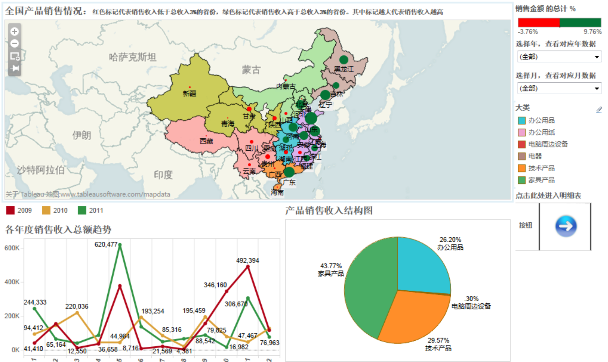
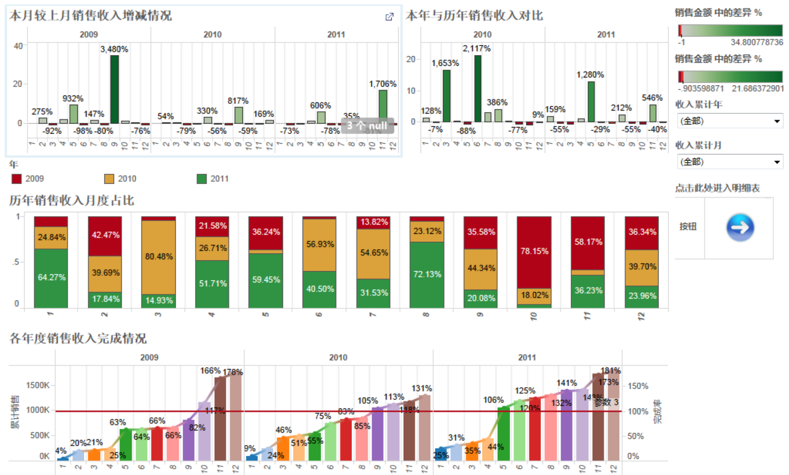
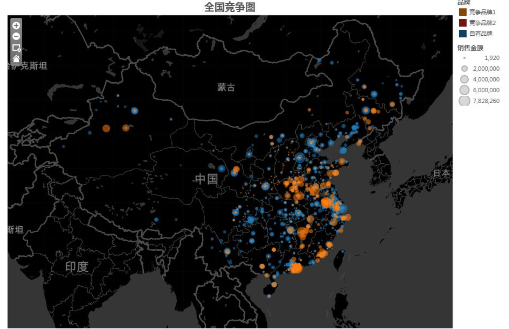
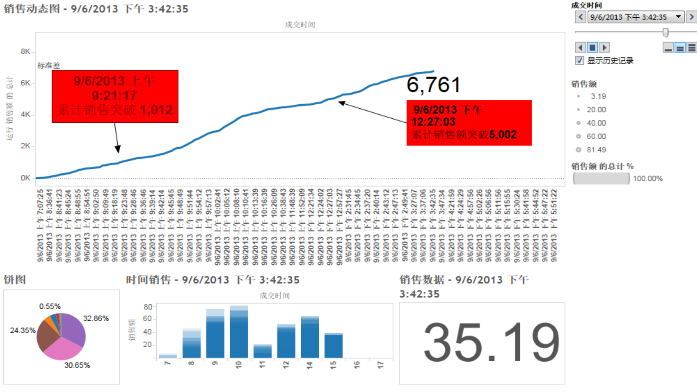

- 客户生命周期
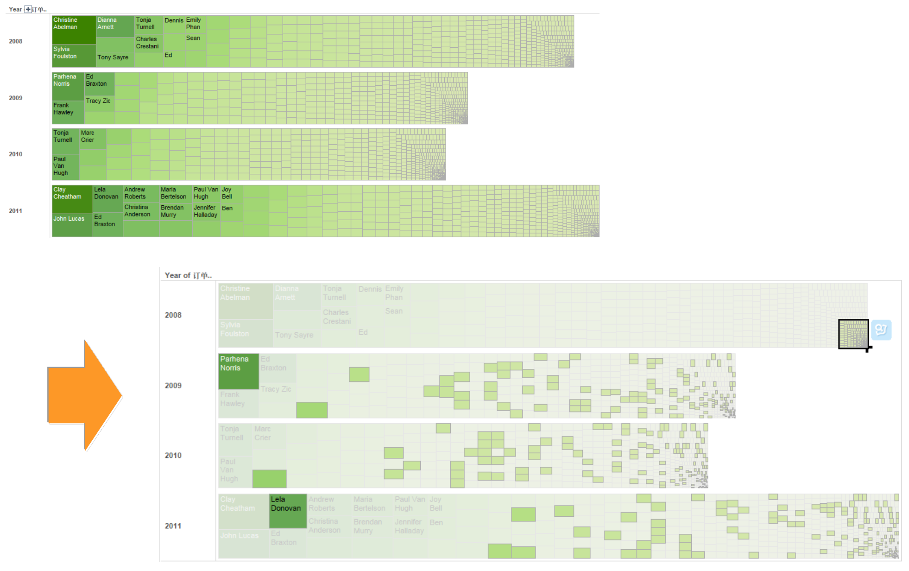

- 定制空间数据可视化
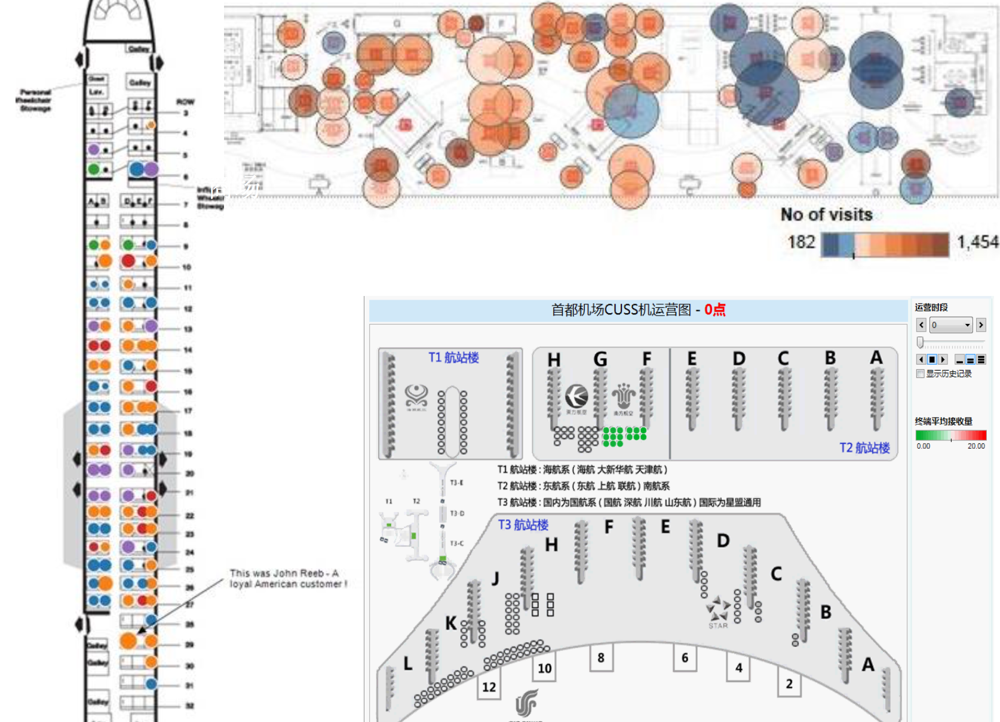

- 支持大数据
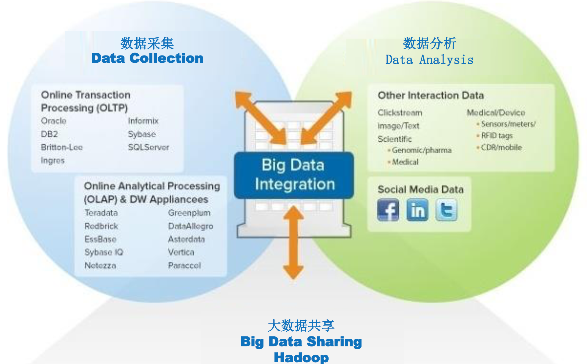

## 四、demo

- 柱状图  
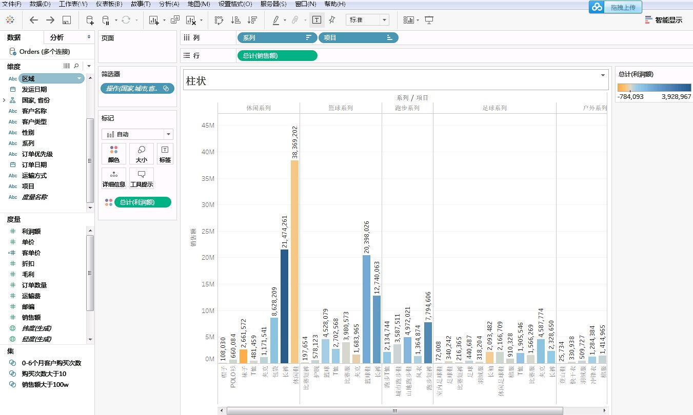

- 地图
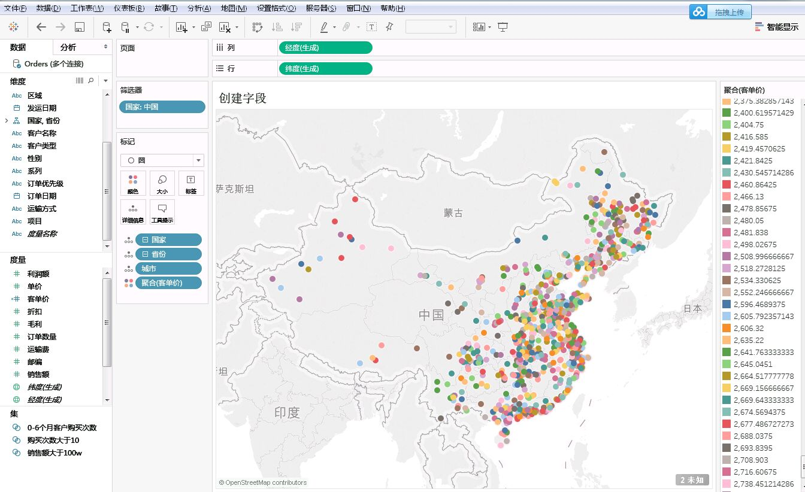

- 生命周期
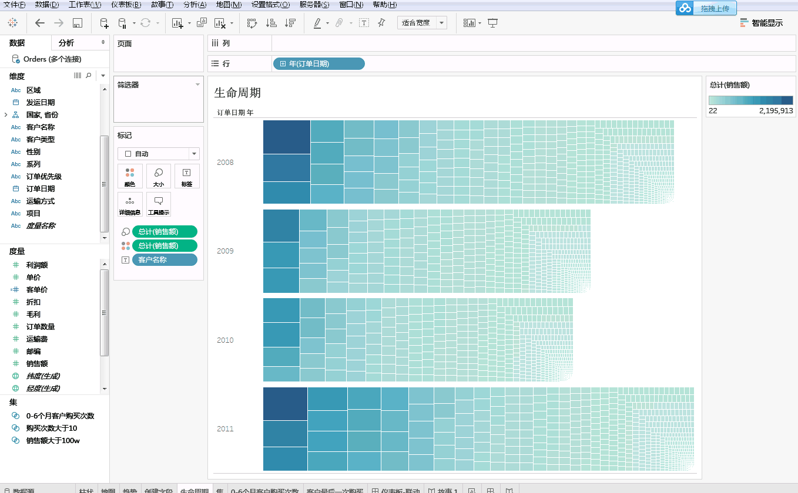

- 数据集
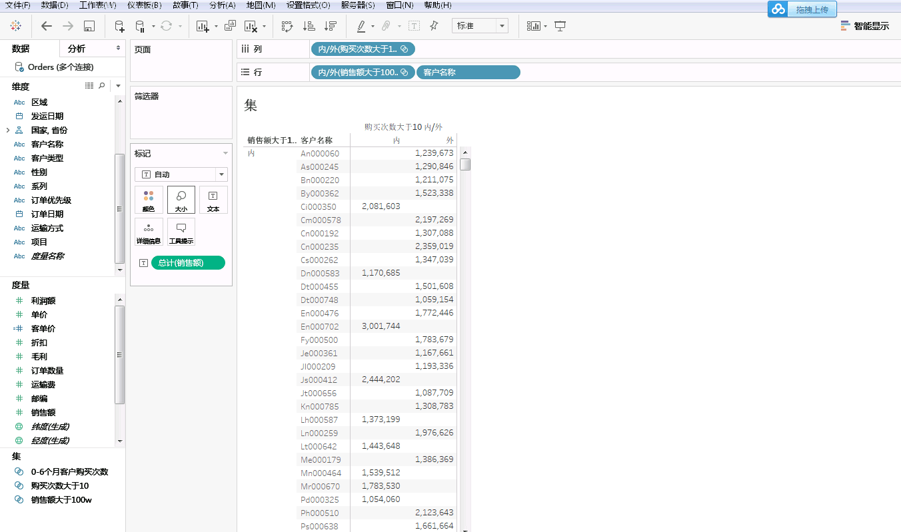
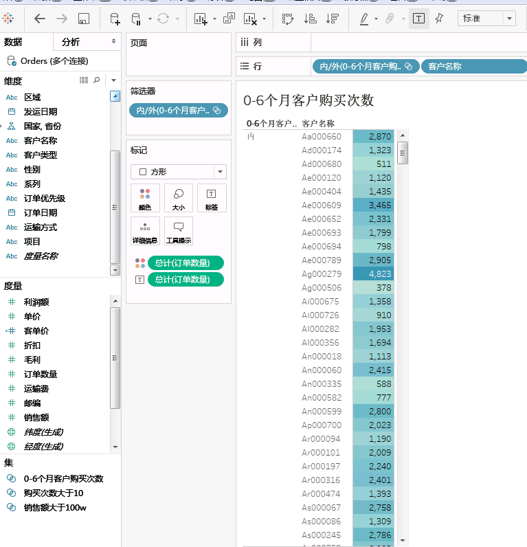

- 仪表盘
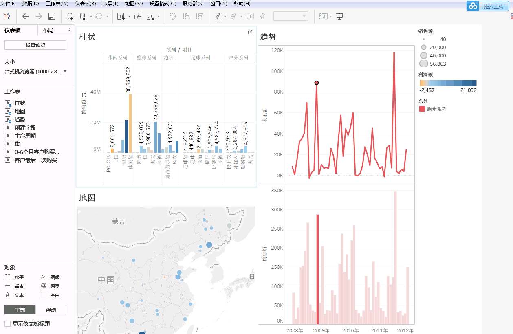

- 故事
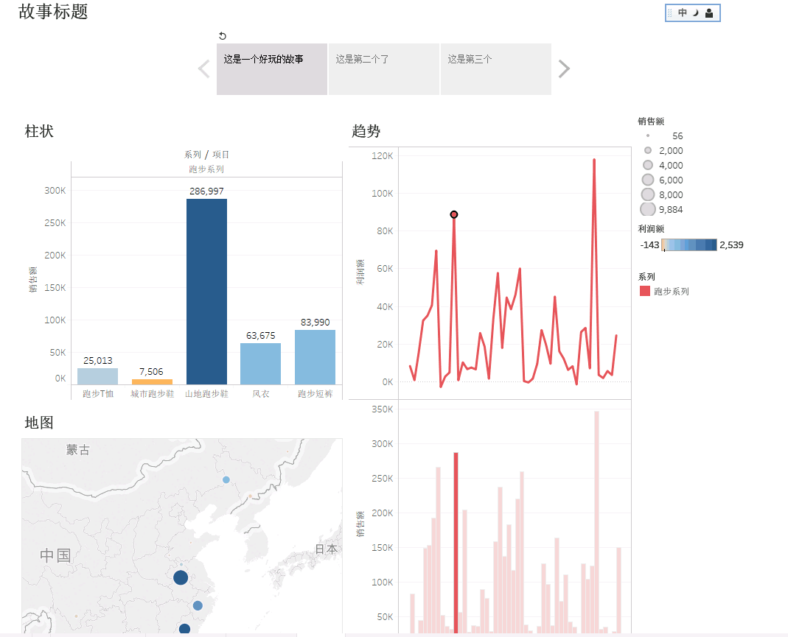
---
