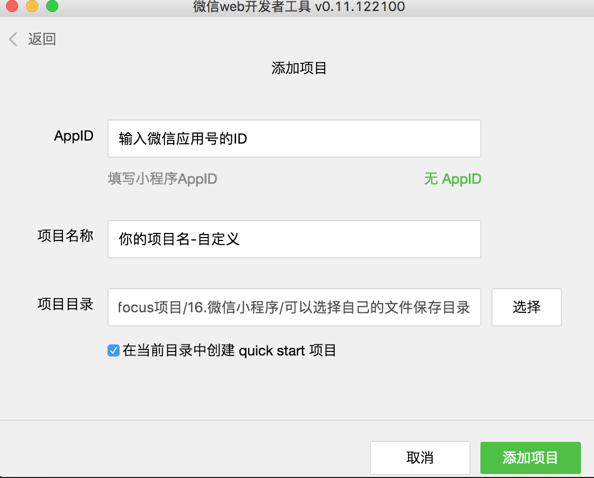
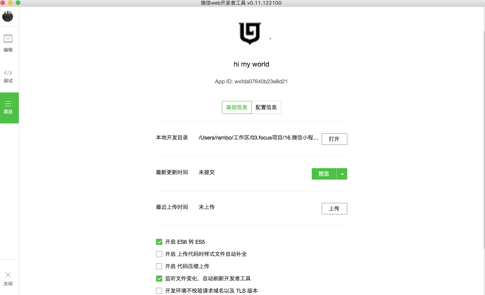
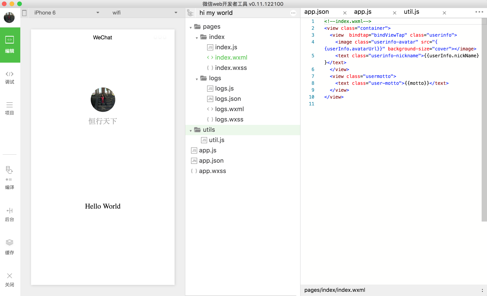
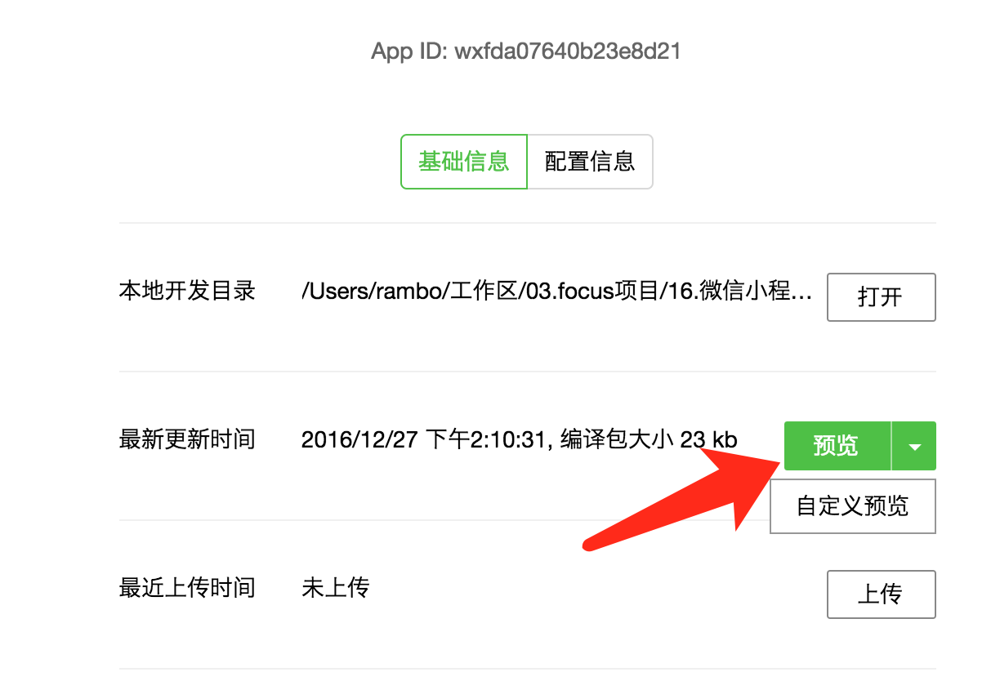
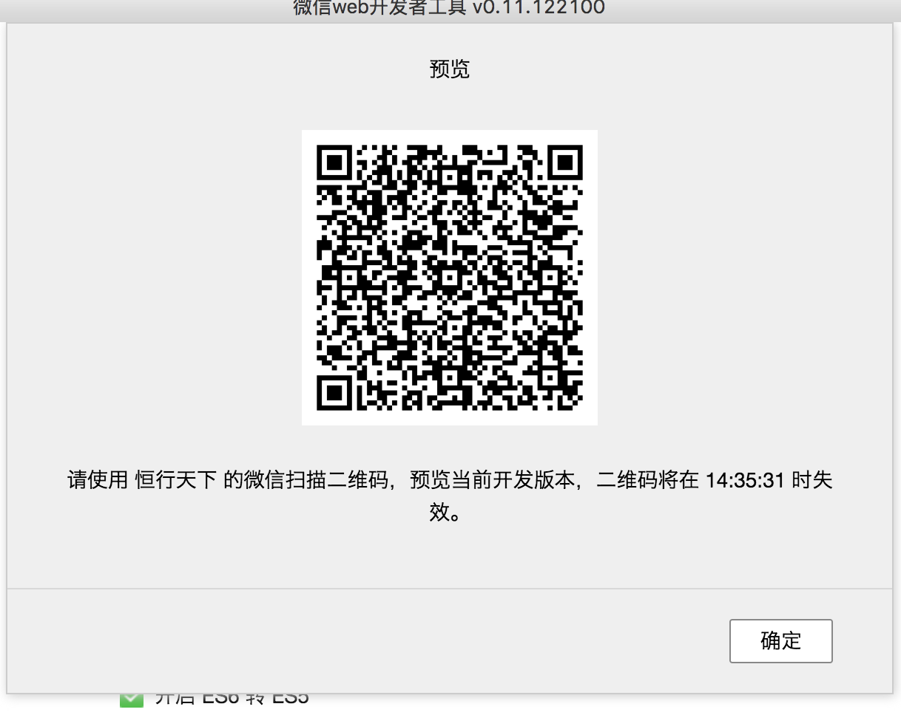

一、微信小程序-一切从这里开始
============================

By [rambo](http://hengxindongli.cn)

## 一、简介
微信小程序，轻应用，用完就走。
## 二、开发工具
开发工具其实是用js开发的。Electron、Nodejs等先制作一个固定的桌面程序，里面嵌入空的浏览器内核，比如chrominum，然后优化程序界面和提供本地调用程序的接口。这样的工具可以远程验证（微信二维码）、可以直接发布不用编译。微信开发工具采用的react + flux架构。
## 神级应用 hello world
### 1.创建项目
- 后自动出现的这些文件组成编程界里最经典的一个应用-hello world。



### 2.程序结构


- app.js整个程序的入口js文件：onLaunch方法在程序初始化时调用，实现程序的逻辑层和数据层。
- json文件用来定义全局的一些配置参数。

```html
{
  "pages": [ // 定义一些页面的位置，这样程序才能找到这些页面
    "pages/index/index"
  ],
  "window": {
    "backgroundTextStyle": "light",  // 下拉背景字体、loading 图的样式，仅支持 dark/light
    "navigationBarBackgroundColor": "#fff", // 导航栏背景颜色
    "navigationBarTitleText": "techzto", // 导航栏标题文字内容
    "navigationBarTextStyle": "black" // 导航栏标题颜色，仅支持 black/white
  }
}
```

- wxss全局的样式定义：实现程序的view视图层
-  wxml文件全局的样式定义：实现程序的view视图层
-  左边按钮【编辑】、【调试】、【项目】、【编译】、【后台】、【缓存】、【关闭】待用到时在一一解锁技能，现在先来看看创建的项目在微信上的表现。
### 3.预览



- 至此你就可以在微信上看到效果了。

---
